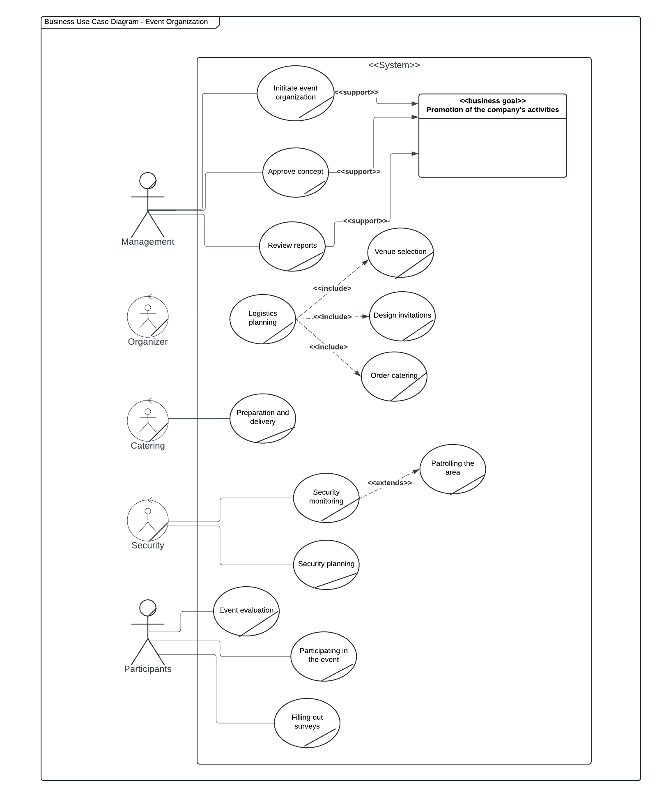
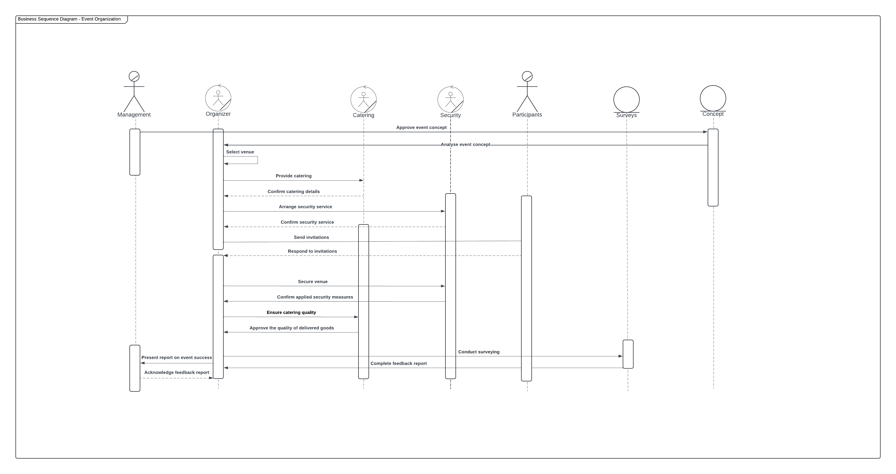

# Event Organization Business Analysis

The process of organizing a corporate event is initiated when the company's board of directors approves the presented event concept. In a situation where the submission is incomplete or inconsistent with the expectations of the board, the responsible department is immediately informed of the decision, which automatically leads to the completion of the process. If the board approves the concept, the project moves to an intensive phase of detailed planning. In this phase, key tasks are carried out in parallel, such as careful selection and reservation of the location, placing detailed orders for the catering including the establishment of a menu in accordance with the preferences of the participants, and the designing attractive invitations, which are then sent to invited guests.

In the context of carrying out the various tasks, the organizer takes on responsibility for logistical coordination, which includes transportation, accommodating guests and scheduling the event. The catering company focuses on preparing and delivering the food, ensuring both the quality of the service and the food. The security office, on the other hand, in addition to developing and implementing effective plans security, monitors the event site and provides informative support to the attendees, which is crucial for their comfort and safety. On the day of the event, security personnel maintain continuous monitoring of the safety of the of venues and participants, and catering operations are coordinated to ensure a smooth catering service. After the event, the organizer conducts collecting feedback from attendees through surveys, which can be either paper-based as well as electronic. The results of these surveys are carefully analyzed to assess the effectiveness of the event.

Depending on the results of the evaluation, the process may end with documentation of the event as an example of success that can serve as a model for future events. If problems are identified, a detailed analysis is conducted to understand the reasons for failures and make the necessary modifications in future projects. The process ends when conclusions are developed and changes and conclusions are properly documented. 

## BPMN

### Description of the impact of the introduced IT solution on the business process flow

Before the introduction of an IT system, processes are more complex, involving more steps and decisions, which involves intensive human interaction. Such organization of processes leads to greater labor intensity and increases the risk of errors associated with manual processing of information and subjective evaluation. After the implementation of an IT system, although the diagrams become much more complex, the entire process runs more smoothly due to the automation of many tasks. The information system introduces clearly defined decision criteria that are more easily applied by machines, which contributes to a more consistent and predictable workflow work. Moreover, once an IT system is in place, processes are better integrated with other systems and tools, enabling a smoother flow of data of data and information. The automation of data collection and processing significantly improves information management, which is crucial in a dynamic business environment. 

## UML

### Business Use Case Diagram

### Business Sequence Diagram

